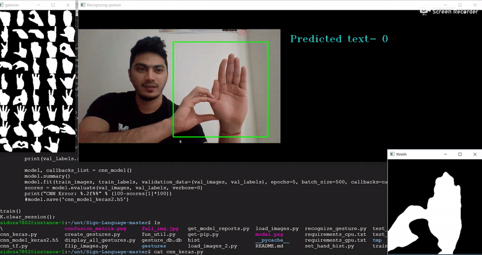
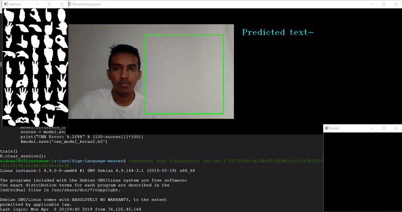
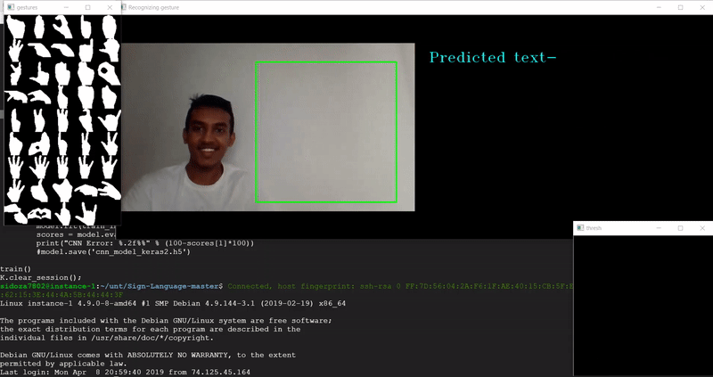
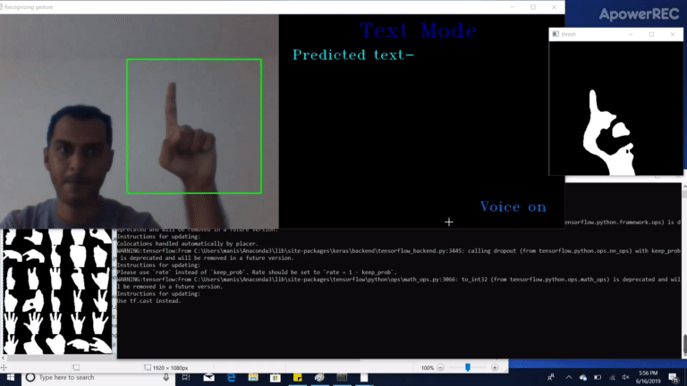
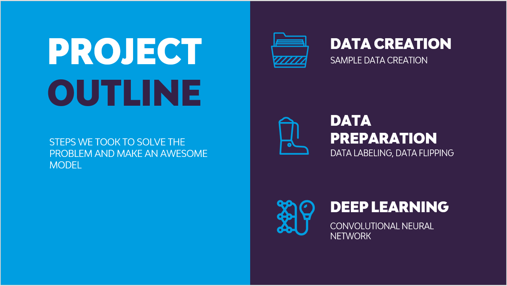
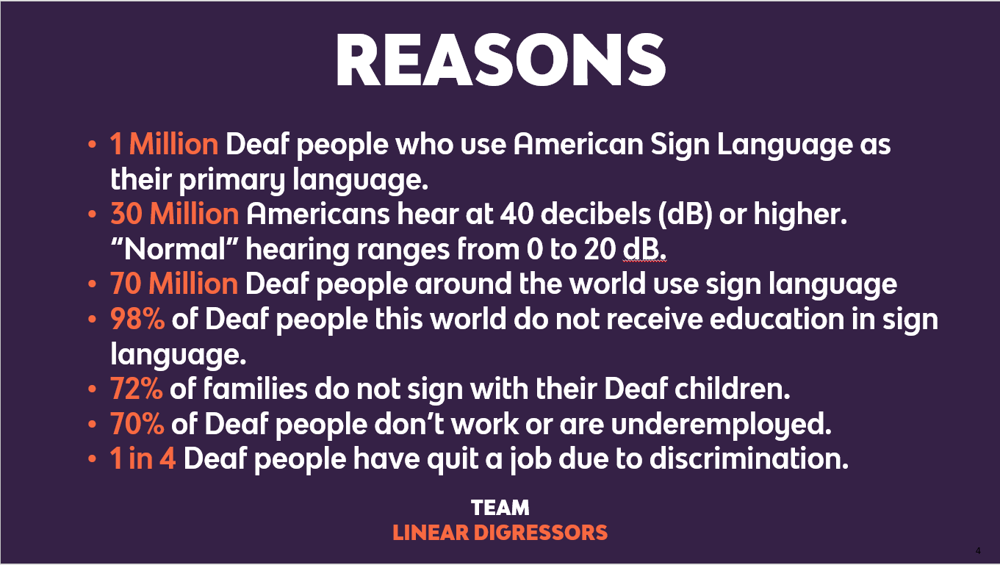

# Sign Language Interpreter using Deep Learning

> A real-time sign language interpreter using live webcam feed and deep learning.

**Author: Syeda Fizzah Batool**

---

## Table of contents
* [General Info](#general-info)
* [Screenshots](#screenshots)
* [Demo](#demo)
* [Technologies and Tools](#technologies-and-tools)
* [Setup](#setup)
* [Process](#process)
* [Code Examples](#code-examples)
* [Features](#features)
* [Status](#status)
* [Future Work](#future-work)
* [Contact](#contact)

## General Info

The goal of this project is to make it easy for the 70 million deaf people across the world to be independent of translators for their daily communication needs. The app acts as a personal translator 24×7, interpreting American Sign Language (ASL) gestures in real time.

## Demo









## Screenshots




## Technologies and Tools
* Python 3
* TensorFlow / Keras
* OpenCV
* SQLite
* pyttsx3 (text-to-speech)
* Streamlit (web deployment)

## Setup

Install dependencies using the provided requirements file:

```
pip install -r requirements.txt
```

Or install from the provided package list:

```
pip install -r Code/Install_Packages.txt
```

## Process

1. Run `Code/set_hand_histogram.py` to calibrate hand detection for your lighting environment.
2. Run `Code/create_gestures.py` to capture gesture samples (1200 images per gesture).
3. Run `Code/Rotate_images.py` to augment the dataset by flipping images.
4. Run `Code/load_images.py` to split the dataset into train/validation/test sets.
5. Run `Code/cnn_model_train.py` to train the CNN model.
6. Run `Code/final.py` to launch the real-time gesture recognition window.

To run the web demo instead:

```
streamlit run app.py
```

## Code Examples

```python
# CNN Model Training

import numpy as np
import pickle
import cv2, os
from glob import glob
from keras import optimizers
from keras.models import Sequential
from keras.layers import Dense, Dropout, Flatten
from keras.layers.convolutional import Conv2D, MaxPooling2D
from keras.utils import np_utils
from keras.callbacks import ModelCheckpoint
from keras import backend as K

K.set_image_dim_ordering('tf')
os.environ['TF_CPP_MIN_LOG_LEVEL'] = '3'

def cnn_model():
    model = Sequential()
    model.add(Conv2D(16, (2,2), input_shape=(50, 50, 1), activation='relu'))
    model.add(MaxPooling2D(pool_size=(2, 2), strides=(2, 2), padding='same'))
    model.add(Conv2D(32, (3,3), activation='relu'))
    model.add(MaxPooling2D(pool_size=(3, 3), strides=(3, 3), padding='same'))
    model.add(Conv2D(64, (5,5), activation='relu'))
    model.add(MaxPooling2D(pool_size=(5, 5), strides=(5, 5), padding='same'))
    model.add(Flatten())
    model.add(Dense(128, activation='relu'))
    model.add(Dropout(0.2))
    model.add(Dense(num_classes, activation='softmax'))
    model.compile(loss='categorical_crossentropy',
                  optimizer=optimizers.SGD(lr=1e-2),
                  metrics=['accuracy'])
    return model
```

## Features

* Real-time ASL gesture recognition via webcam
* Supports 44 ASL characters with >95% accuracy
* **Text mode**: builds words and sentences from recognised gestures
* **Calculator mode**: perform arithmetic using hand gestures
* Text-to-speech output (toggle with `v` key)
* Gesture stabilisation (requires 20 consistent frames before confirming)

Features that can be added in the future:
* Increase vocabulary beyond 44 characters
* Add support for two-handed and motion-based signs
* Incorporate a feedback/correction mechanism
* Support additional sign languages beyond ASL

## Status

Project is: _complete_.

## Future Work

* Migrate hand detection from HSV histogram to MediaPipe Hands for better lighting robustness
* Train on a larger, publicly available dataset
* Add multi-language sign support

## Contact

Created by **Syeda Fizzah Batool**

[](LICENSE)
